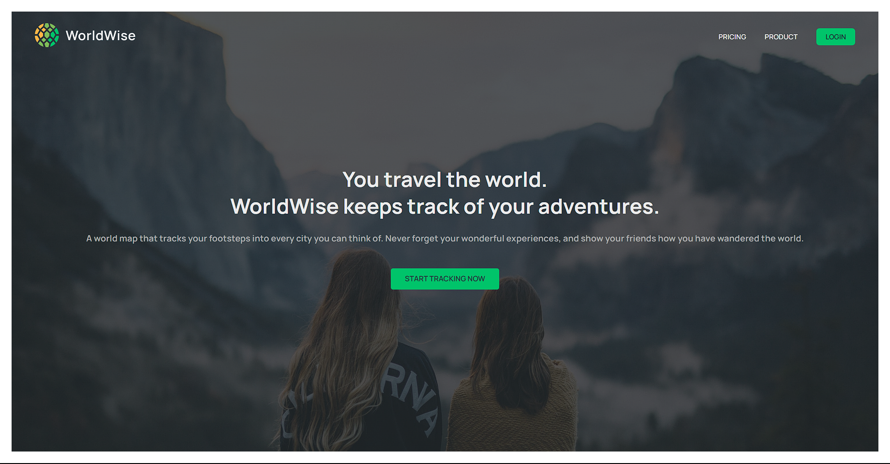
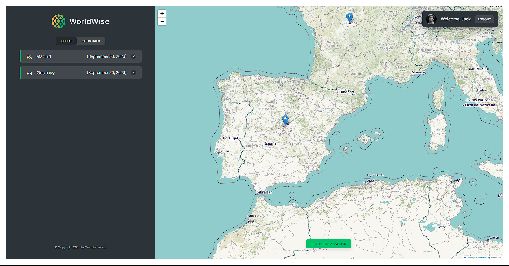

# The World Wise

The World Wise is a web app, that helps you to not lose track of countries that u visited thru out of your journey across the world.

# Introduce

WorldWise is an app that enables you save the places where you have been and the places you want to go. It is a simple app that allows you to create a list of places you have been and places you want to go. You can also add notes to each place. It is a great way to keep track of your travels and plan your next trip.

# Features

- Create a list of places you have been and places you want to go.
- Add notes to each place.
- View a map of all the places you have been and places you want to go.
- Smoothly select the country you want to visit and add it to your list.
- Remove cities from your list.

# Technologies Used

- React
- TypeScript
- React Router Dom
- Leaflet - React Leaflet
- CSS Modules
- Redux

# Live Demo

Check out the live app here: [The WorldWise](https://worldwise-brown-pi.vercel.app/)

# App

# Acknowledgments

This app was developed as part of the Udemy course by Jonas Schmedtmann. I have independently refactored the code to TypeScript.
